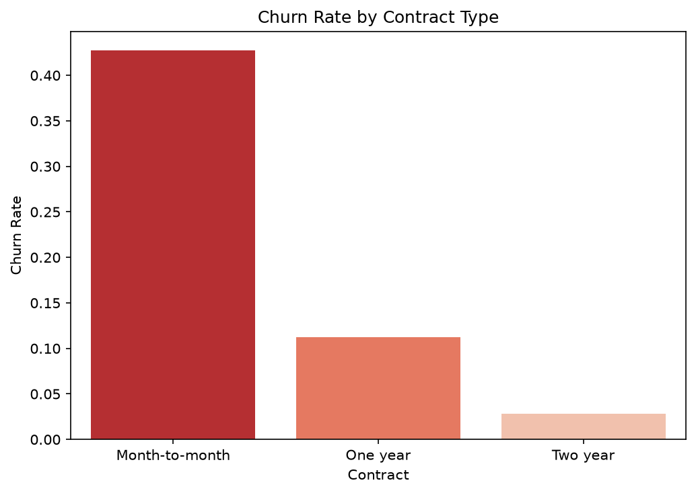
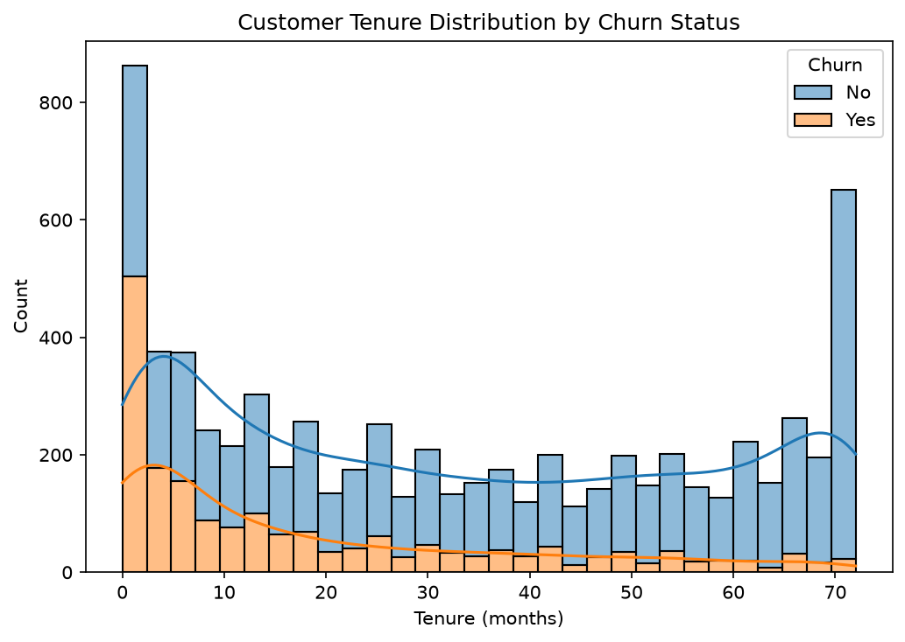
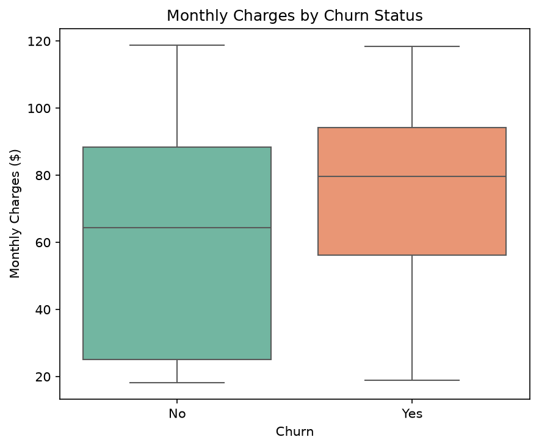
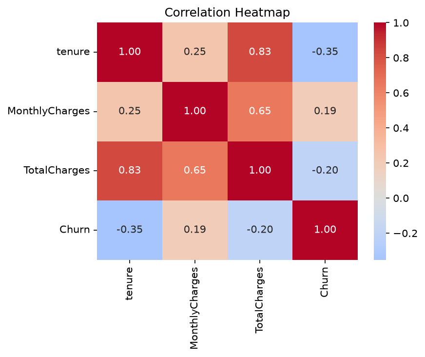
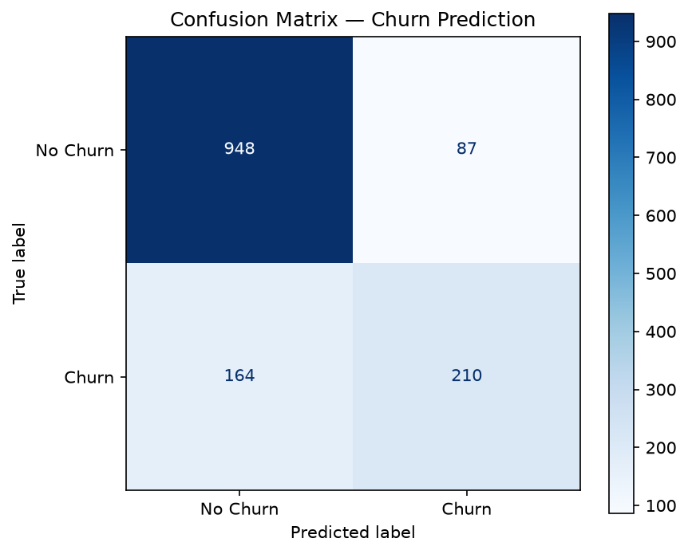
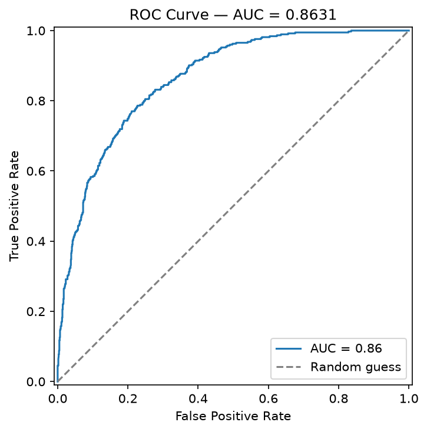

# Telco Customer Churn — End-to-End Pipeline

Predicts which customers are likely to churn using the Telco Customer Churn dataset (~7,043 rows). Covers data cleaning, exploratory analysis, model training/tuning, evaluation, and a servable API.

## Results

- **Best model:** XGBoost (tuned via RandomizedSearchCV)
- **Test-set ROC-AUC:** 0.8482
- **Precision / Recall / F1 (churn class):** 0.67 / 0.53 / 0.59
- Churn is strongly driven by **contract type** (month-to-month churns far more than longer contracts), **low tenure**, and **higher monthly charges** — see charts below.

## Exploratory Data Analysis

**Churn rate by contract type** — month-to-month customers churn at a much higher rate than 1- or 2-year contracts.

**Tenure distribution by churn status** — churners cluster heavily at low tenure (newer customers).

**Monthly charges by churn status** — churners tend to pay more per month.

**Correlation heatmap** — tenure correlates negatively with churn; charges correlate positively.

## Model Evaluation

**Confusion matrix** on the held-out test set.

**ROC curve** — AUC 0.8482, well above the random-guess diagonal.

## 1. Setup

    python -m venv venv && source venv/Scripts/activate
    pip install -r requirements.txt

## 2. Get the data

Download from Kaggle:
https://www.kaggle.com/datasets/blastchar/telco-customer-churn

Place the CSV here:

    data/WA_Fn-UseC_-Telco-Customer-Churn.csv

## 3. Explore the data

    python src/01_eda.py

Surfaces the dataset's main gotcha: TotalCharges is stored as text with blank strings for customers with tenure == 0, and confirms the class imbalance (~27% churn).

## 4. Generate EDA charts

    python src/02_charts.py

Saves the four exploratory charts shown above to images/.

## 5. Train the pipeline

    python src/train.py

This will:

- Clean the data (fix TotalCharges, recode SeniorCitizen, drop dupes)
- Engineer two extra features (AvgChargesPerTenure, NumAddonServices)
- Split into stratified train/test (80/20)
- Cross-validate three candidate models (Logistic Regression, Random Forest, XGBoost) on ROC-AUC
- Evaluate all three on the held-out test set
- Run a RandomizedSearchCV hyperparameter search on the best candidate
- Refit the tuned pipeline on the full dataset
- Save the complete pipeline to models/churn_pipeline.joblib
- Save all metrics to models/metrics.json

Because preprocessing lives inside the saved sklearn Pipeline, there's zero risk of train/serve skew.

## 6. Generate evaluation charts

    python src/03_eval_charts.py

Saves the confusion matrix and ROC curve shown above to images/.

## 7. Serve predictions

    uvicorn src.serve:app --reload --port 8000

Then send a POST request to http://localhost:8000/predict with a customer's JSON data. It returns a churn probability and a Yes/No prediction.

## Notes / where to go next

- Imbalance is handled via class_weight="balanced" / tree weighting.
- Track prediction drift in production and retrain periodically.
- Add SHAP on the tuned model if per-prediction explanations are needed.